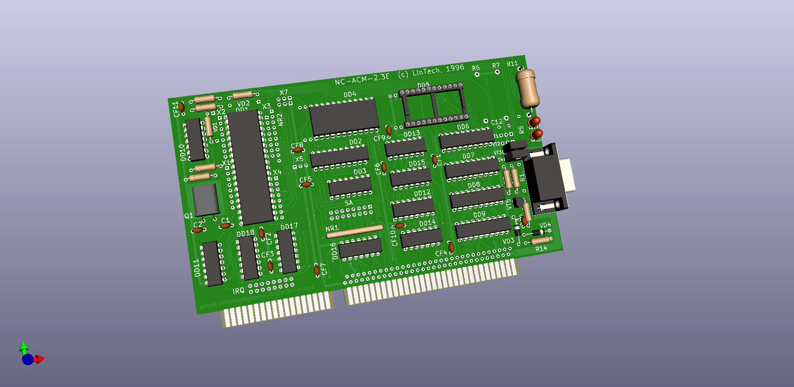

# LInTech - плата Головной Машины (ГМ) - сервера IBM-PC

Платы реконструированы [Night Gryphon](https://night-gryphon.ru/vcard) по фото/сканам оригиналов плат, имеющихся в наличии у [Arseny](https://uknc.narod.ru/) (NC-ACM-2.2-1994) и [Serebriakov](https://github.com/PaulArgent) (NC-ACM-2.3E-1996).

В данный момент заказываются тестовые образцы платы 2.3.

Отдельное спасибо:
- [Arseny](https://uknc.narod.ru/) за исходные и дополнительные фото оригинальной платы версии NC-ACM-2.2-1994, отсмотр/поиск/прозвонку непонятных мест
- [Serebriakov](https://github.com/PaulArgent) за качественные сканы и дополнительные фото оригинальной платы версии NC-ACM-2.3E-1996.
- [Maxiol](https://forum.maxiol.com/) за помощь в воссоздании/проверке аналоговой части схемы
- Станиславу Масловски за опознание маркировки компонентов

Содержание:
- KiCad - проект реконструкции плат в формате KiCad
- LinTech-GM-board_NC-ACM-\*.pdf - реконструированые **схемы** плат 2.2 и 2.3Е
- Gerbers - **GERBER** файлы и **BOM**, списки компонентов для изготовления реплик
- Firmware - микропрограмма контроллера Intel 8051. Варианты для разных КУВТ и с разными лицензиями, см. README файлы.
- Reference_Photo - исходные фото, по которым велась реконструкция
- Cable - фото и схема соединительного кабеля
- [Software](./Software/) - **ПО головной машины**

Библиотека прошивок микроконтроллера платы и учительское ПО любезно предоставлены Станиславом Кононовым из ЛИнТех при содействии [Serebriakov](https://github.com/PaulArgent).

Плата версии 2.2 реконструирована по фото и с непосредственной помощью [Arseny](http://uknc.narod.ru/). 

Плата версии 2.3Е реконструирована по качественным сканам [Serebriakov](https://github.com/PaulArgent) и схеме платы 2.2. 

**Плата 2.3 имеет следующие отличия:**
- расширен блок перемычек выбора прерывания. Теперь доступны прерывания 3, 4, 7, 10, 11 (по умолчанию), 12
- светодиоды перенесены рядом с планкой и теперь видны снаружи корпуса РС, светодиод LD2 на линии "Reset" заменен на зеленый.
- добавлена возможность не запаивать не использовать часть аналоговой схемы. Добавлен подтягивающий резистор R8.
- Транзистор VT3 заменен на КТ646Б, изменены номиналы некоторых резисторов/конденсаторов.
- линия запроса прерывания вынесена из под кварцевого резонатора и добавлен земляной полигон.
- блоки перемычек заменены печатными джамперами в положении по умолчанию

На момент публикации реальные платы по данной реконструкции не изготавливались / не тестировались в железе, в проекте возможны неточности.

Реконструированые платы не являются точной копией оригинала. Положение дорожек и их форма, положение компонентов незначительно отличаются от оригинала т.к. рисовались с нуля в своей сетке с учетом современных возможностей производства и т.д. 

## Техническое описание
**[WIP]**

Плата построена на базе микроконтроллера Intel 8051 (ДД1).
 
ОЗУ контроллера расширено 573РУ10 (ДД4). Возможно размещение в этом ОЗУ как данных так и исполнение кода.
Возможна работа с микропрограммой во внешнем ПЗУ (ДД5) (требует проверки) после установки джампера Х5 в положение 2-3.

Адресное пространство контроллера разбито на 4 части по старшим битам адреса 14 и 15, что реализуется дешифратором ДД3:
- В старшей части 0xFххх расположен порт данных обмена с РС построеный на 1533ИР22 (ДД6, ДД7). 
- В адресах 0х4ххх расположено дополнительное ОЗУ
- В адресах 0х0ххх (предположительно) может быть установлено ПЗУ с внешней микропрограммой (ДД5)

При получении данных от РС в порт данных - выдается прерывание Int0 (триггер ДД13-А). Младший бит адреса порта данных, в который производилась запись, может быть прочитан из порта Р3 бит 4.

При чтении РС из порта данных выдается прерывание Int1 (триггер ДД13-Б)

Для запроса прерывания на РС необходимо записать "1" в порт Р3 бит 5.

При перезагрузке РС по сигналу RESET на шине ISA микроконтроллер так же переводится в ресет до снятия бита ресета со стороны РС записью "0" в бит 7 порта управления.

Обмен с линией осуществляется через последовательный порт RXD/TXD.

### Интерфейс PC
Базовый адрес портов В/В выбирается перемычками SA.1-7 которые соответствуют битам 3-9 адреса порта.

По умолчанию:
0x0120, 0х0121 - порт данных (Port 67: ДД6, ДД7)
0x0122 - порт статуса и управления (Port 89: ДД8, ДД9)

Чтение:
	3 - "1" = поступили данные от контроллера
	4 - "1" = порт данных свободен, данные прочитаны контроллером
	5 - контроллер выход T1/Port3.5
	6 - "1" = разрешено прерывание
	7 - перемычка SA.8

Запись
	6 - "1" = разрешить прерывание
	7 - ресет контроллера. После перезагрузки PC контроллер находится в ресете и надо записать "0" в этот бит для старта платы.

Прерывание 11 (может быть изменено перемычками IRQ) - выход MCU Port3 bit 4, со стороны PC разрешается записью "1" в бит 6 регистра управления.

Известные проблемы платы:
- при использовании прерывания ISA у некоторых экземпляров платы происходили его ложные срабатывания/помехи вплоть до "завешивания" РС. 
Предположительно связано с разводкой линии прерывания на плате версии 2.2. В плате версии 2.3 это было изменено.

### Описание микропрограммы
[Требуется помощь]

## Сетевой протокол
[Требуется помощь]
